# FTC 19168 R25B Architecture Diagrams (Mermaid)

> **How to view these diagrams:**
> - **GitHub**: Paste into any `.md` file - renders automatically
> - **Mermaid Live Editor**: https://mermaid.live - paste code, export as PNG/SVG
> - **VS Code**: Install "Markdown Preview Mermaid Support" extension, then `Ctrl+Shift+V`

---

## 1. Class Inheritance Hierarchy

### What is this diagram?
Think of this like a **family tree for our robot's code**. Just like how children inherit traits from their parents (eye color, height), our code files "inherit" abilities from parent files.

### Why does this matter?
- **Code Reuse**: Instead of writing the same code over and over, we write it once in a "parent" and all "children" automatically get those abilities
- **Organization**: The tree shows how our 10+ different robot programs are organized - they all share common foundations
- **Efficiency**: When we fix a bug in a parent, all children get the fix automatically

### Key Takeaways:
- **LinearOpMode** (at the top) is provided by FIRST - it's the starting point for ALL FTC robot programs
- **DarienOpModeFSM** is our team's main foundation - it contains all our hardware setup and smart behaviors
- **TeleOpFSM** is what runs during driver control (when humans drive the robot)
- **BlueGoalSide1, RedGoalSide1, etc.** are our autonomous programs (robot drives itself)

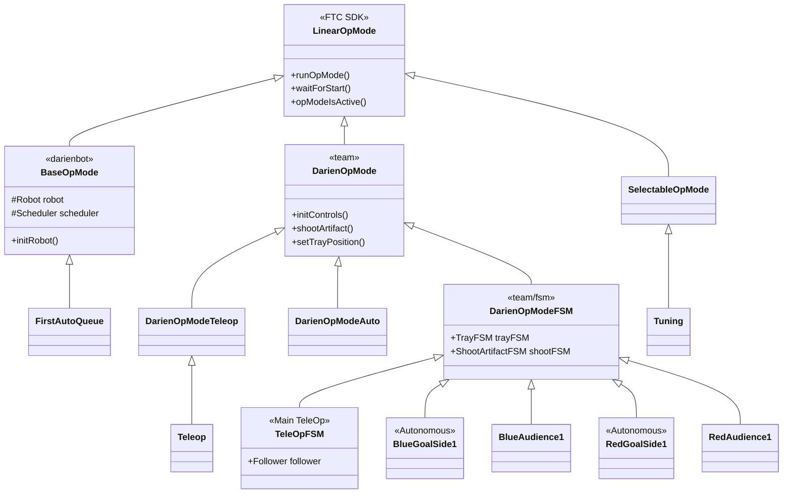

---

## 2. Command-Based Architecture Flow

### What is this diagram?
This shows how we organize the robot's **brain and body parts**. Think of it like a restaurant kitchen:
- **Robot** = The entire kitchen with all its stations
- **Subsystems** = Individual stations (grill, prep, desserts) - each handles one job
- **Scheduler** = The head chef calling out orders in sequence
- **Commands** = Individual orders ("make burger", "plate salad")

### Why does this matter?
- **Modularity**: Each subsystem (Drive, Intake, Tray, Scoring) works independently - if one breaks, others keep working
- **Sequential Actions**: The Scheduler ensures the robot does things in the right order (can't shoot before loading!)
- **Easy Testing**: We can test each "station" separately before combining them

### Key Takeaways:
- **DriveSubsystem** = The 4 wheels that move the robot
- **IntakeSubsystem** = The mechanism that picks up game pieces
- **TraySubsystem** = Holds game pieces before scoring
- **ScoringSubsystem** = Launches/places game pieces to score points

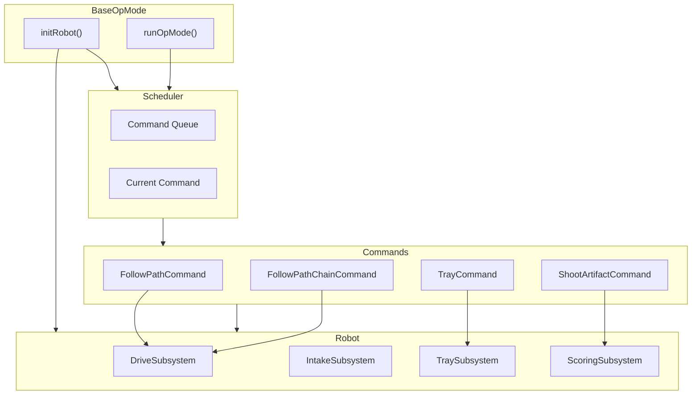

---

## 2b. Command Interface

### What is this diagram?
This shows the **blueprint for all robot actions**. Every action the robot can do follows the same 4-step pattern - like a recipe template that all dishes must follow.

### The 4 Steps Every Command Follows:
1. **init()** = "Get ready" - Set up everything needed before starting
2. **update()** = "Keep working" - Do a little bit of work each cycle (runs 50+ times per second!)
3. **isFinished()** = "Are we done yet?" - Check if the action is complete
4. **end()** = "Clean up" - Reset everything for the next action

### Why does this matter?
- **Consistency**: Every action works the same way, making the code predictable
- **Interruptible**: Because we check "are we done?" constantly, we can stop mid-action if needed (safety!)
- **Composable**: We can chain commands together like LEGO blocks

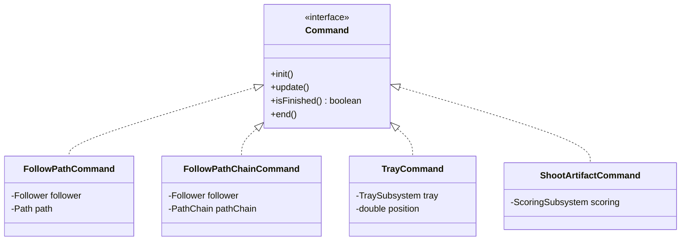

---

## 2c. Scheduler Execution Flow

### What is this diagram?
This is a **timeline showing how the robot processes commands** - like watching a conveyor belt at a factory. It shows the conversation between the main program, the scheduler (task manager), commands (tasks), and the physical robot.

### Reading this diagram:
- Time flows from **top to bottom**
- Arrows show **messages/instructions** being passed between components
- The loop box means "repeat this over and over very fast"

### The Process:
1. Main program says "here's a task to do"
2. Scheduler queues it up and starts it when ready
3. Command runs a tiny bit each cycle (50+ times per second)
4. When done, command reports back and scheduler moves to next task

### Why does this matter?
- **Non-blocking**: The robot never "freezes" waiting for something - it's always checking and responding
- **Smooth motion**: By doing tiny updates very fast, movements look smooth, not jerky

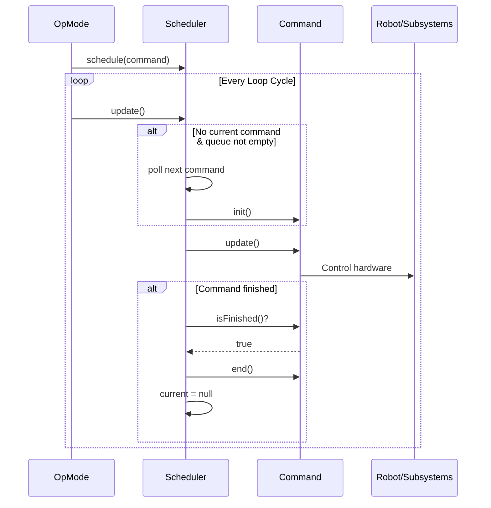

---

## 3. FSM State Diagrams

### What is FSM?
**FSM = Finite State Machine**. Think of it like a **flowchart that the robot follows**. The robot can only be in ONE state at a time (like how you can only be in one room at a time), and specific events cause it to move to the next state.

### Why use State Machines?
- **Predictable**: We always know exactly what the robot is doing
- **Safe**: The robot can't accidentally do two conflicting things at once
- **Debuggable**: If something goes wrong, we know exactly which "room" the robot was in

---

### 3a. TrayFSM - Automated Intake

### What does this do?
This controls the **automatic loading of game pieces into the tray**. When activated, the robot automatically:
1. Positions the tray to the first slot
2. Waits for a ball to be detected by the color sensor
3. Identifies if it's purple or green
4. Moves to the next slot
5. Repeats until all 3 slots are filled

### The States Explained:
- **IDLE** = Waiting, doing nothing (like a vending machine waiting for coins)
- **POSITION_TO_SLOT** = Moving the tray to the correct position
- **INTAKE_WAIT** = Watching the color sensor, waiting for a ball
- **CHECK_SLOT** = Ball detected! Figure out what color it is
- **FINISHING** = All slots full, wrapping up
- **DONE** = Complete, ready for next action

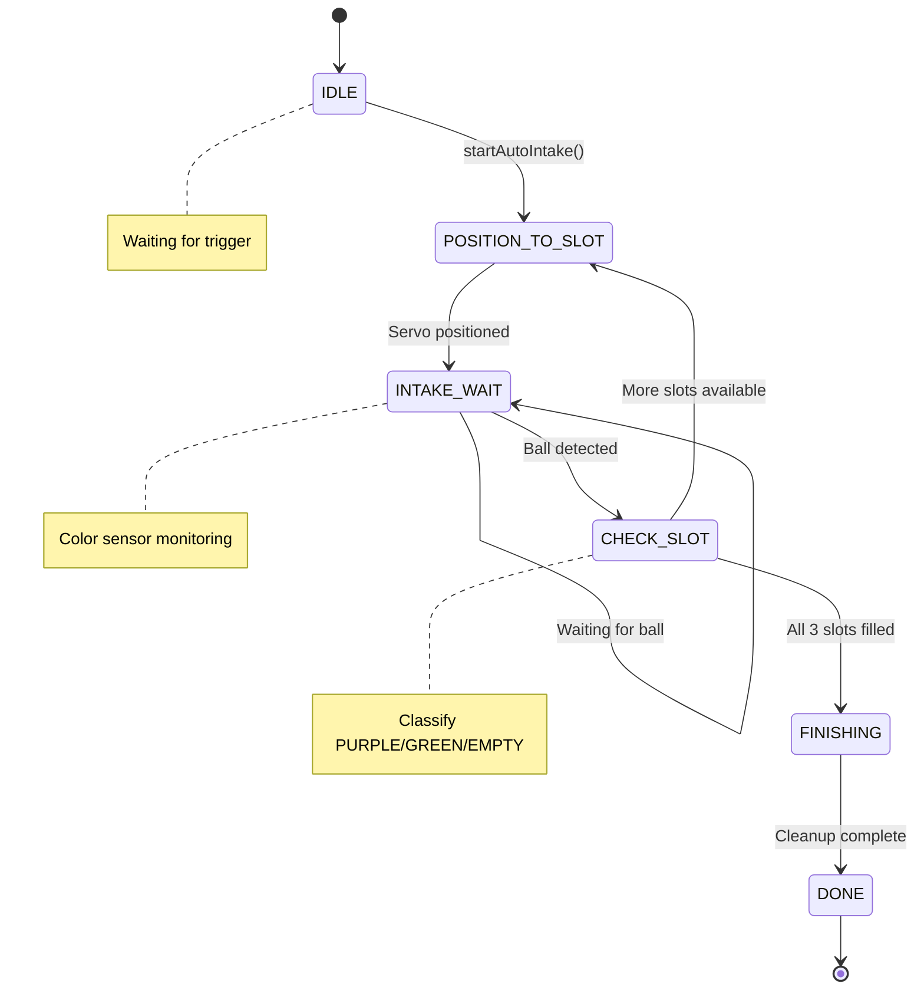

---

### 3b. ShootArtifactFSM - Single Shot Sequence

### What does this do?
This controls the **precise sequence to launch one game piece**. It's like a pitching machine - everything must happen in the exact right order and timing.

### The Sequence:
1. **IDLE** → Waiting for shoot command
2. **ELEVATOR_UP** → Raise the ball into firing position
3. **SPINUP** → Start the launching wheels spinning (need to reach full speed!)
4. **FEED** → Push the ball into the spinning wheels
5. **SPINDOWN** → Slow down the wheels
6. **RESET** → Return elevator and feeder to starting position

### Why so many steps?
- Wheels need time to reach full speed (shooting too early = weak shot)
- Precise timing between feeding and wheel speed = consistent shots
- Resetting properly = ready for the next shot immediately

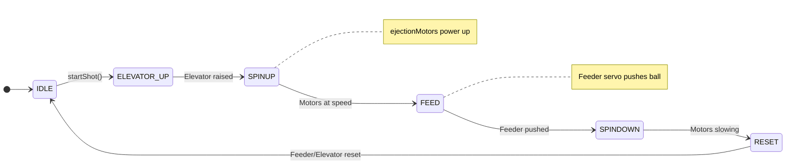

---

### 3c. TeleOpFSM - Main Driver Control

### What does this do?
This is the **main brain during driver-controlled period**. It manages everything the robot does when humans are driving with game controllers.

### The Three Main Modes:
- **DRIVING** = Normal driving, human has full control of movement
- **INTAKE** = Automated ball collection is running (TrayFSM takes over)
- **SHOOTING** = Launching sequence is running (ShootFSM takes over)

### How it works:
- Driver presses **Y button** → Robot switches to INTAKE mode (auto-collects balls)
- Driver presses **Right trigger** → Robot switches to SHOOTING mode (launches ball)
- When automation finishes → Returns to DRIVING mode

### Why is this smart?
- Driver doesn't need to manually control every servo and motor for complex actions
- One button press triggers a perfectly-timed sequence every time
- Driver can focus on strategy and positioning while robot handles the details

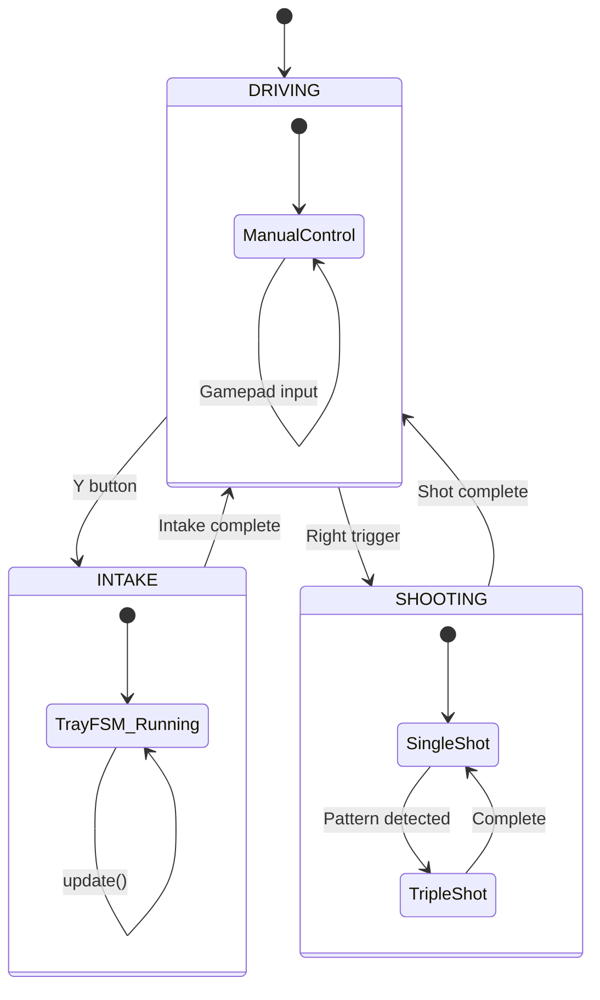

---

## 4. Hardware Component Diagram

### What is this diagram?
This is the **robot's body map** - showing all the physical parts (motors, servos, sensors) and how they're organized. Think of it like an anatomy diagram.

### Understanding the Parts:

**Drive System (The Legs)**
- 4 motors for mecanum wheels - allows the robot to move in ANY direction (forward, sideways, diagonal, spin)
- Named by position: Left Front, Right Front, Left Rear, Right Rear

**Scoring System (The Arm)**
- 2 ejection motors = spinning wheels that launch balls (like a pitching machine)
- Elevator servo = raises balls into firing position
- Feeder servo = pushes balls into the spinning wheels

**Intake System (The Hands)**
- Tray servo = rotates the tray to different slot positions
- Intake servo = lowers/raises the intake mechanism
- Rubber bands = continuous rotation servo that pulls balls in

**Sensors (The Eyes & Touch)**
- Color sensor = detects ball color (purple vs green) and distance
- Webcam = sees AprilTags (special QR-code-like markers) for navigation
- Odometry = tracks exactly where the robot is on the field

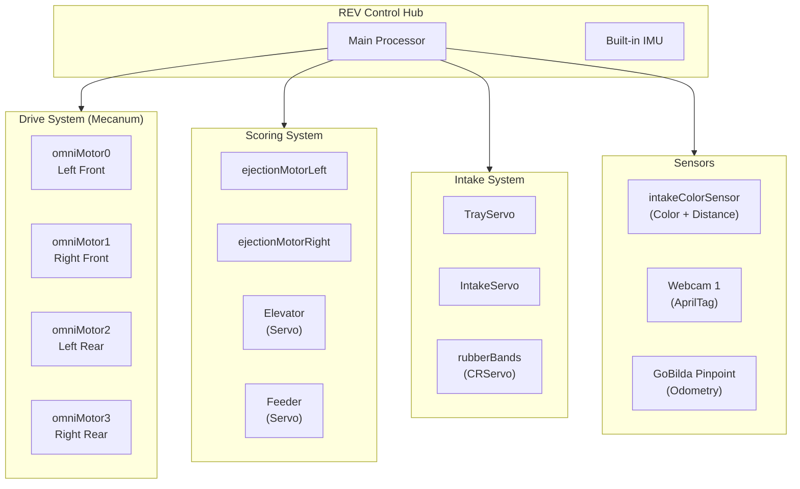

---

## 4b. Hardware Connections Detail

### What is this diagram?
This shows **how everything plugs into the brain** (REV Control Hub). Like a wiring diagram for the robot.

### Types of Connections:

**DC Motors** (6 total)
- High-power devices that spin continuously
- Used for: driving wheels, launching mechanism

**Servos** (5 total)
- Precise position control devices
- Regular servos: move to exact angles (tray, elevator, feeder, intake)
- Continuous Rotation (CR) servo: spins like a motor but with servo control (rubber bands)

**I2C Devices** (2 total)
- Digital communication bus for smart sensors
- Color sensor: detects colors and distance
- Pinpoint odometry: tracks robot position with high precision

**USB Devices** (1 total)
- Webcam for computer vision (seeing AprilTags)

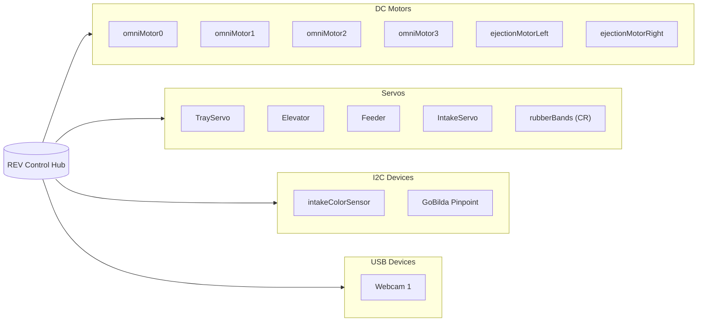

---

## 5. Data Flow - Autonomous Period

### What is this diagram?
This shows **how information flows during autonomous** (when the robot drives itself with NO human input for 30 seconds).

### The Flow Explained:

**INPUT (Sensors) → PROCESSING (Brain) → OUTPUT (Actions)**

1. **AprilTag Detection** = Camera sees markers on the field, tells robot where it is
2. **Odometry Position** = Wheel encoders track exactly how far robot has moved
3. **Path State Machine** = Decides "what should we do next?" based on the game plan
4. **Pedro Follower** = Calculates exact motor powers to follow the planned path smoothly
5. **FSMs** = Handle complex actions like intake and shooting automatically

### Why is this important?
- During autonomous, there's NO driver input - robot must think for itself
- Sensors are the robot's only way to understand the world
- Good autonomous = more points before the driver even touches the controller!

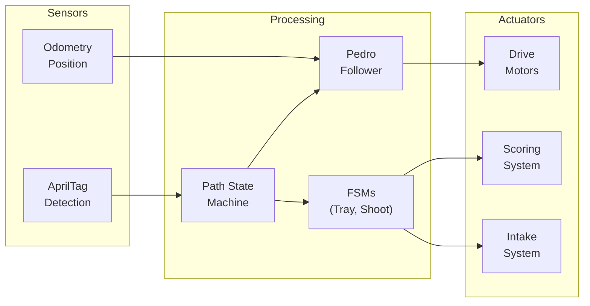

---

## 6. Data Flow - TeleOp Period

### What is this diagram?
This shows **how information flows during driver control** (when humans drive the robot for 2 minutes).

### The Flow Explained:

**HUMAN INPUT → ROBOT BRAIN → PHYSICAL ACTIONS**

1. **Gamepad 1 (Driver)** = Joysticks control driving, buttons trigger actions
2. **Gamepad 2 (Operator)** = May control secondary functions (shooting power, etc.)
3. **Sensors** = Still providing feedback (color sensor for intake)
4. **TeleOpFSM** = Translates human input into robot actions
5. **Motors/Servos** = Physical movements happen
6. **Telemetry** = Data displayed on driver station screen for feedback

### The Human-Robot Partnership:
- **Human decides WHAT** (drive here, pick up that, shoot now)
- **Robot decides HOW** (exact motor speeds, servo timing, sensor checks)
- Best of both worlds: human strategy + robot precision

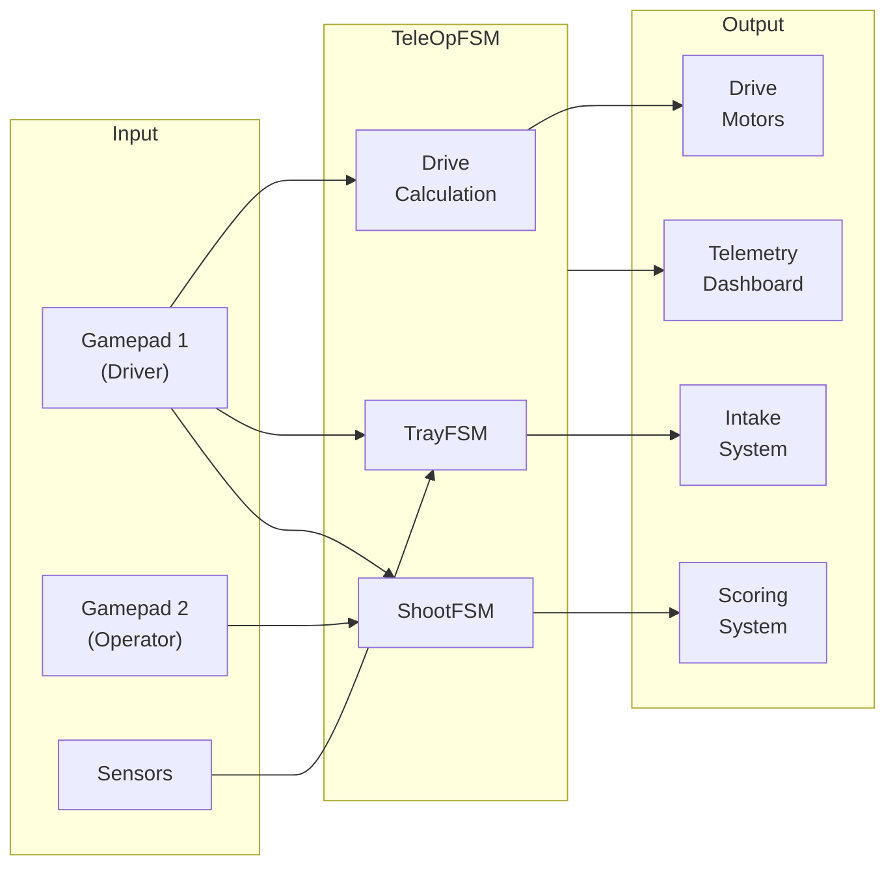

---

## 7. External Dependencies

### What is this diagram?
This shows the **libraries and tools we use** that were built by others. We don't reinvent the wheel - we use proven, tested code from the FTC community.

### The Libraries Explained:

**FTC SDK** (Required - from FIRST)
- The foundation that ALL FTC robots must use
- Provides: basic robot control, hardware access, competition framework

**Pedro Pathing** (Path Following)
- Makes the robot follow smooth curved paths during autonomous
- Like GPS navigation for the robot - "turn left in 20 inches"
- Uses advanced math (Bezier curves) for smooth, fast motion

**FTC Dashboard** (Debugging Tool)
- Lets us see what the robot is "thinking" in real-time on a laptop
- Can change settings WITHOUT re-uploading code (huge time saver!)
- Shows graphs of sensor values, motor powers, etc.

**Panels Telemetry** (Enhanced Display)
- Makes the driver station display prettier and more organized
- Easier to read during fast-paced competition

### Why use libraries?
- **Faster development**: Don't spend months writing path following code
- **Tested & reliable**: Used by hundreds of teams, bugs already found and fixed
- **Community support**: Can ask questions, find examples online

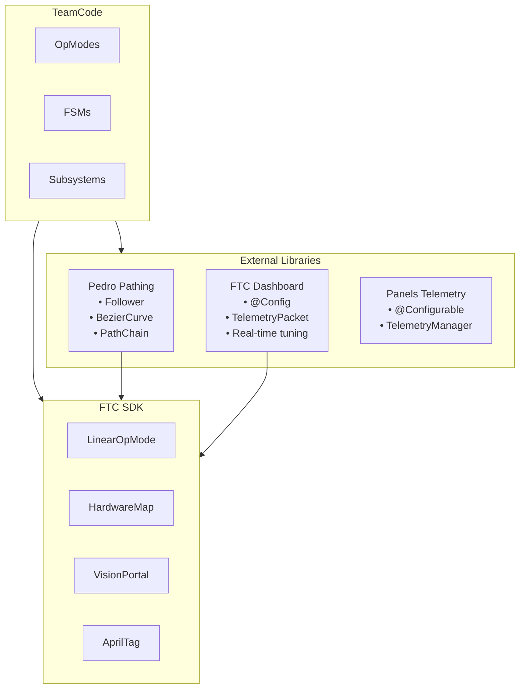

---

## Quick Export Instructions

### Mermaid Live Editor (Recommended)
1. Go to https://mermaid.live
2. Copy any diagram code (between the ` ```mermaid ` and ` ``` ` markers)
3. Paste into the editor
4. Click "Actions" → "Export as PNG" or "Export as SVG"

### GitHub
1. Create or edit any `.md` file in your repository
2. Paste the diagram code including the ` ```mermaid ` markers
3. Commit - GitHub renders it automatically

### VS Code
1. Install extension: "Markdown Preview Mermaid Support"
2. Open this file
3. Press `Ctrl+Shift+V` for preview
4. Right-click preview → "Export to PNG"
